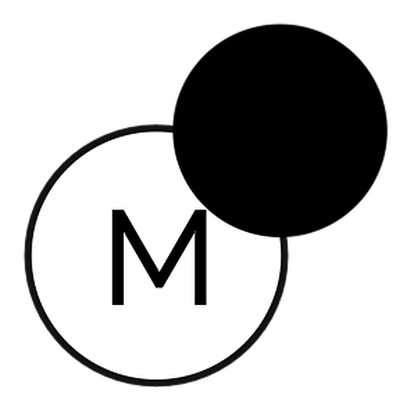
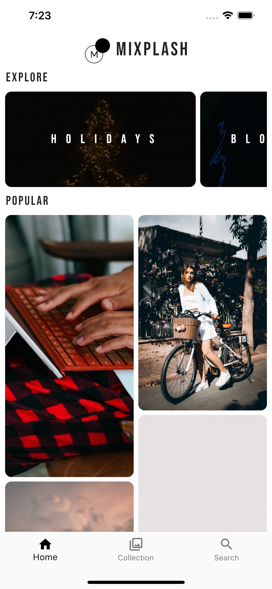
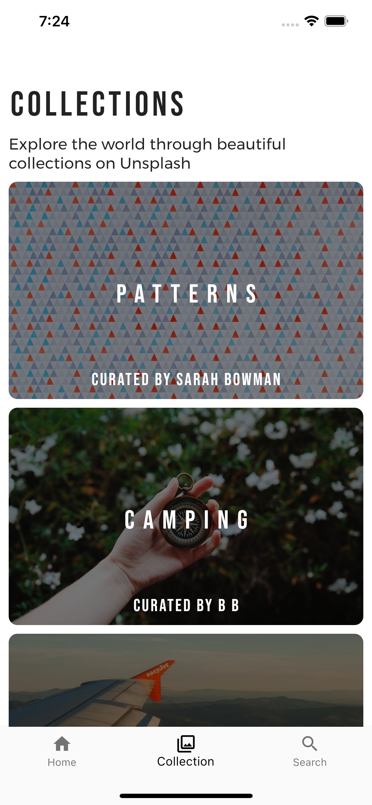
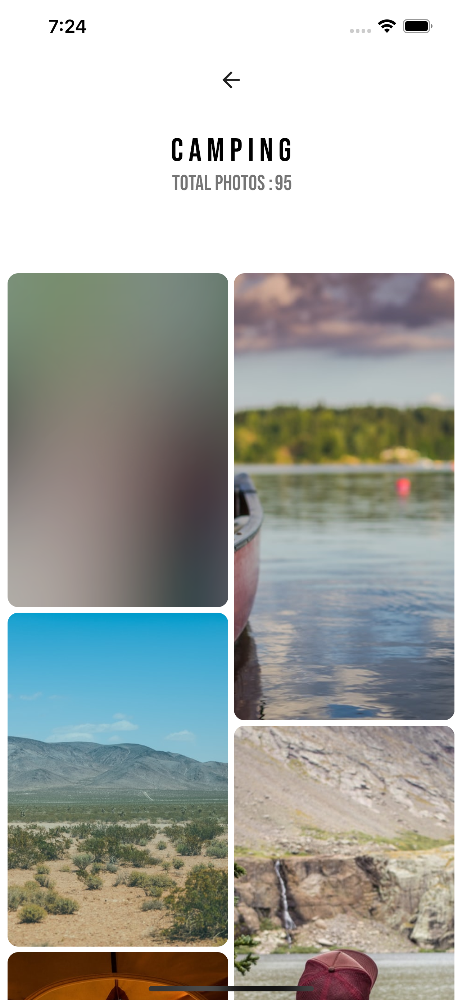
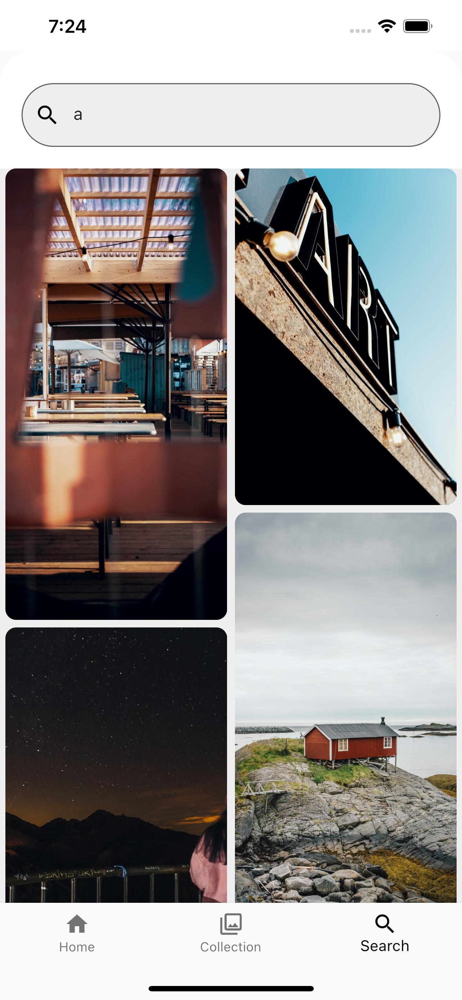

<p align="center">
  <a href="" rel="noopener">
 </a>
</p>

<h3 align="center">MiXplash</h3>

<div align="center">

[]()
[](https://github.com/kylelobo/The-Documentation-Compendium/issues)
[](https://github.com/kylelobo/The-Documentation-Compendium/pulls)
[](/LICENSE)

</div>

---

<p align="center"> MiXplash : Beautiful Images and Wallpapers
    <br>
</p>

## 📝 Table of Contents

- [📝 Table of Contents](#-table-of-contents)
- [🖼️ Screenshots <a name = "screenshots"></a>](#️-screenshots-)
- [🧐 About <a name = "about"></a>](#-about-)
- [🏁 Getting Started <a name = "getting_started"></a>](#-getting-started-)
  - [Prerequisites](#prerequisites)
- [🎈 Usage <a name="usage"></a>](#-usage-)
- [🚀 Deployment <a name = "deployment"></a>](#-deployment-)
- [⛏️ Built Using <a name = "built_using"></a>](#️-built-using-)
- [✍️ Authors <a name = "authors"></a>](#️-authors-)
- [🎉 Acknowledgements <a name = "acknowledgement"></a>](#-acknowledgements-)

## 🖼️ Screenshots <a name = "screenshots"></a>








## 🧐 About <a name = "about"></a>

This is personal project for downloading and sharing of photos. Thank to Unsplash for allowing the use of their API .

## 🏁 Getting Started <a name = "getting_started"></a>

These instructions will get you a copy of the project up and running on your local machine for development and testing purposes. See [deployment](#deployment) for notes on how to deploy the project on a live system.

### Prerequisites

What things you need to install the software and how to install them.

```
Flutter & Dart installed.
Android Studio Code/VSCode installed

```

## 🎈 Usage <a name="usage"></a>

The app is pretty self-explanatory

## 🚀 Deployment <a name = "deployment"></a>

You can deploy on the phone either Android/iOS .

## ⛏️ Built Using <a name = "built_using"></a>

- [Dart](https://dart.dev/) - Backend Server
- [Flutter](https://flutter.dev/) - Front-End Framework

## ✍️ Authors <a name = "authors"></a>

- [@itsyaasir](https://github.com/itsyaasir) - Idea & Initial work

See also the list of [contributors](https://github.com/kylelobo/The-Documentation-Compendium/contributors) who participated in this project.

## 🎉 Acknowledgements <a name = "acknowledgement"></a>

- Hat tip to anyone whose code was used
- Inspiration
- References
